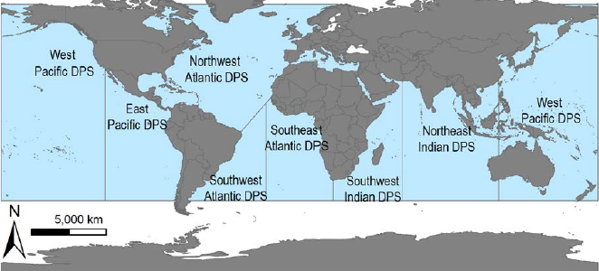
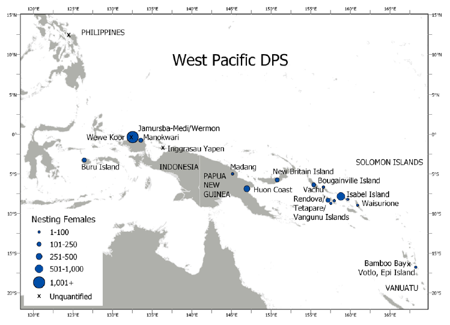
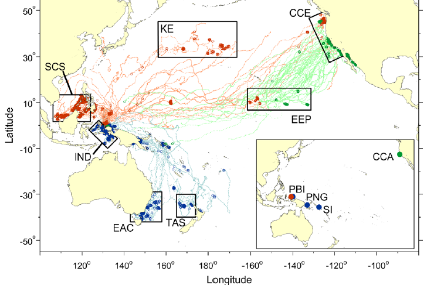
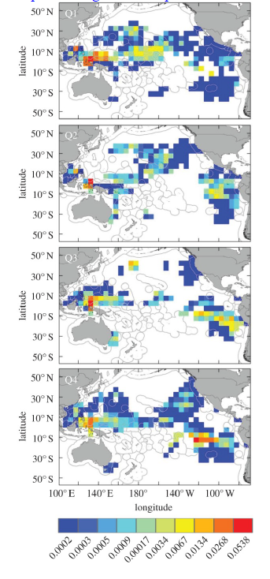

```{r setup, include=FALSE}
knitr::opts_chunk$set(echo = FALSE, warning = FALSE, message = FALSE)
library(ggplot2)
library(dplyr)
library(tidyr)
library(flextable)
library(jagsUI) 

# ==============================================================================
# 1. DEFINE CORE FUNCTIONS 
# ==============================================================================

# --- Imputation Engine ---
aggregate_monthly_to_annual <- function(df, quiet = FALSE) {
  df <- df %>%
    dplyr::mutate(Year = as.numeric(Year), Count = as.numeric(Count)) %>%
    dplyr::filter(!is.na(Year), !is.na(Site))

  if (!"Month" %in% names(df)) {
    return(df %>%
             dplyr::group_by(Year, Site) %>%
             dplyr::summarise(Count = if(all(is.na(Count))) NA_real_ else sum(Count, na.rm = TRUE), .groups = "drop"))
  }

  df <- df %>% dplyr::mutate(Month = as.numeric(Month)) %>% dplyr::filter(!is.na(Month))

  # Track valid months to prevent extreme extrapolation
  valid_years <- df %>%
    dplyr::group_by(Year, Site) %>%
    dplyr::summarise(valid_months = sum(!is.na(Count) & Count > 0), .groups = "drop")

  df_clean <- df %>%
    dplyr::group_by(Year, Month, Site) %>%
    dplyr::summarise(Count = if(all(is.na(Count))) NA_real_ else sum(Count, na.rm = TRUE), .groups = "drop")

  all_years <- min(df_clean$Year, na.rm = TRUE):max(df_clean$Year, na.rm = TRUE)
  sites <- sort(unique(df_clean$Site))
  n_years <- length(all_years)
  n_timeseries <- length(sites)

  full_grid <- expand.grid(Month = 1:12, Year = all_years, Site = sites, stringsAsFactors = FALSE)

  prep_df <- full_grid %>%
    dplyr::left_join(df_clean, by = c("Year", "Month", "Site")) %>%
    dplyr::arrange(Year, Month) %>%
    tidyr::pivot_wider(names_from = Site, values_from = Count) %>%
    dplyr::select(all_of(sites))

  y_matrix <- as.matrix(prep_df)
  y_matrix[y_matrix == 0] <- NA
  y_matrix <- log(y_matrix)

  periods <- rep(12, n_timeseries)
  for(i in 1:n_timeseries) {
    if(grepl("W_|Wermon|Wamlana|Waspait|Waenibe", sites[i], ignore.case = TRUE)) {
      periods[i] <- 6
    }
  }

  jags_data <- list(
    y = y_matrix, m = rep(1:12, times = n_years), n.steps = nrow(y_matrix),
    n.months = 12, pi = pi, period = periods, n.timeseries = n_timeseries, n.years = n_years
  )

  model_string <- "
  model{
    for(j in 1:n.timeseries) {
       predX0[j] ~ dnorm(5, 0.1)
       predX[1,j] <- c[j, m[1]] + predX0[j]
       X[1,j] ~ dnorm(predX[1,j], tau.X[j])
       y[1,j] ~  dnorm(X[1,j], tau.y[j])
       for (t in 2:n.steps){
           predX[t,j] <-  c[j,m[t]] + X[t-1, j]
           X[t,j] ~ dnorm(predX[t,j], tau.X[j])
           y[t,j] ~  dnorm(X[t,j], tau.y[j])
        }
        for (y in 1:n.years){
           for (mm in 1:12){
              tmp2[y, mm, j] <- exp(X[(y*12 - mm + 1), j])
           }
           N[y, j] <- log(sum(tmp2[y,,j]))
        }
    }
    for (j in 1:n.timeseries){
        for (k in 1:n.months){
            c.const[j, k] <-  2 * pi * k / period[j]
            c[j, k] <- beta.cos[j] * cos(c.const[j,k]) + beta.sin[j] * sin(c.const[j,k])
        }
        sigma.y[j] ~ dgamma(2, 0.5)
        tau.y[j] <- 1/(sigma.y[j] * sigma.y[j])
        beta.cos[j] ~ dnorm(0, 1)
        beta.sin[j] ~ dnorm(0, 1)
        sigma.X[j] ~ dgamma(2, 0.5)
        tau.X[j] <- 1/(sigma.X[j] * sigma.X[j])
    }
  }"

  jm <- jagsUI::jags(
    data = jags_data, parameters.to.save = c("N"), model.file = textConnection(model_string),
    n.chains = 3, n.iter = 10000, n.burnin = 5000, n.thin = 5, parallel = FALSE
  )

  N_sims <- jm$q50$N
  if (is.null(dim(N_sims))) N_sims <- matrix(N_sims, ncol = 1)

  imputed_results <- list()
  for (i in 1:n_timeseries) {
    imputed_results[[i]] <- data.frame(Year = all_years, Site = sites[i], Count = exp(as.vector(N_sims[, i])))
  }
  res_df <- do.call(rbind, imputed_results)

  first_valid <- df %>%
    dplyr::filter(!is.na(Count) & Count > 0) %>%
    dplyr::group_by(Site) %>%
    dplyr::summarise(first_year = min(Year, na.rm=TRUE), .groups = "drop")

  res_df <- res_df %>%
    dplyr::left_join(first_valid, by = "Site") %>%
    dplyr::left_join(valid_years, by = c("Year", "Site")) %>%
    dplyr::mutate(
      Count = ifelse(Year < first_year, NA_real_, Count),
      Count = ifelse(is.na(valid_months) | valid_months < 2, NA_real_, Count) 
    ) %>%
    dplyr::select(-first_year, -valid_months)

  return(res_df)
}

calculate_abundance <- function(df, clutch_freq = 5.5, remig_int = 3.06, quiet = FALSE) {
  df %>% dplyr::mutate(Annual_Nesters = Count / clutch_freq, Total_Adult_Females = Annual_Nesters * remig_int)
}

run_turtle_model <- function(df, iter = 150000, burnin = 50000, thin = 10) {
  all_years <- min(df$Year, na.rm = TRUE):max(df$Year, na.rm = TRUE)
  sites <- sort(unique(df$Site))
  n.yrs <- length(all_years)
  n.timeseries <- length(sites)

  prep_df <- df %>%
    dplyr::group_by(Year, Site) %>%
    dplyr::summarise(Annual_Nesters = if(all(is.na(Annual_Nesters))) NA_real_ else sum(Annual_Nesters, na.rm = TRUE), .groups = "drop") %>%
    tidyr::complete(Year = all_years, Site = sites) %>%
    dplyr::arrange(Year) %>%
    tidyr::pivot_wider(names_from = Site, values_from = Annual_Nesters) %>%
    dplyr::select(all_of(sites))

  mat_data <- as.matrix(prep_df)
  mat_data[mat_data == 0 | is.nan(mat_data)] <- NA
  Y_matrix <- t(log(mat_data))

  x0_mean <- mean(Y_matrix, na.rm = TRUE)
  if(is.na(x0_mean)) x0_mean <- 5

  jags_data <- list(
    Y = Y_matrix, n.yrs = n.yrs, n.timeseries = n.timeseries,
    a_mean = 0, a_tau = 1 / (4^2), u_mean = 0, u_tau = 1 / (0.5^2),
    q_alpha = 0.01, q_beta = 0.01, r_alpha = 0.01, r_beta = 0.01,
    x0_mean = x0_mean, x0_tau = 1 / (10^2)
  )

  model_string <- "
  model {
    A[1] <- 0
    for(i in 2:n.timeseries) { A[i] ~ dnorm(a_mean, a_tau) }
    for(i in 1:n.timeseries) {
      tauR[i] ~ dgamma(r_alpha, r_beta)
      R[i] <- 1/tauR[i]
      for(t in 1:n.yrs) { Y[i,t] ~ dnorm(X[t] + A[i], tauR[i]) }
    }
    tauQ ~ dgamma(q_alpha, q_beta)
    Q <- 1/tauQ
    U ~ dnorm(u_mean, u_tau)
    X0 ~ dnorm(x0_mean, x0_tau)
    X[1] ~ dnorm(X0 + U, tauQ)
    for(t in 2:n.yrs) { X[t] ~ dnorm(X[t-1] + U, tauQ) }
  }"

  fit <- jagsUI::jags(
    data = jags_data, parameters.to.save = c("U", "Q", "R", "X0", "X", "A"),
    model.file = textConnection(model_string),
    n.chains = 2, n.iter = iter, n.burnin = burnin, n.thin = thin, parallel = FALSE
  )
  return(list(fit = fit, years = all_years))
}

get_posteriors <- function(res, remig_int = 3.06) {
  fit <- res$fit; years <- res$years; fy <- length(years)
  A_sims <- fit$sims.list$A
  if (is.null(dim(A_sims))) A_sims <- matrix(A_sims, ncol = 1)
  n_sites <- ncol(A_sims)
  X_final <- fit$sims.list$X[, fy]
  n_draws <- length(X_final)
  X_fym0 <- rep(0, n_draws)
  for (i in 1:n_sites) { X_fym0 <- X_fym0 + exp(X_final + A_sims[, i]) }
  
  median_r <- median(fit$sims.list$U)
  pct_change <- round((exp(median_r) - 1) * 100, 2)
  median_N_fym0 <- median(X_fym0)
  total_females <- round(median_N_fym0 * remig_int) 
  
  draws_df <- data.frame(U = fit$sims.list$U, Q = fit$sims.list$Q, N_fym0 = X_fym0)
  
  return(list(
    draws = draws_df,
    summary = list(
      U_pct = pct_change, Q_med = round(median(fit$sims.list$Q), 4),
      N_fym0 = round(median_N_fym0), Total_Females = total_females
    )
  ))
}

plot_turtle_status <- function(res, abund) {
  fit <- res$fit; years <- res$years; n_yrs <- length(years)
  A_sims <- fit$sims.list$A
  if (is.null(dim(A_sims))) A_sims <- matrix(A_sims, ncol = 1)
  n_sites <- ncol(A_sims)
  
  X0_sims <- fit$sims.list$X0; X_sims  <- fit$sims.list$X
  X0_total <- rep(0, length(X0_sims)); X_total  <- matrix(0, nrow = nrow(X_sims), ncol = ncol(X_sims))
  for (i in 1:n_sites) {
    X0_total <- X0_total + exp(X0_sims + A_sims[, i])
    X_total  <- X_total + exp(sweep(X_sims, 1, A_sims[, i], "+"))
  }
  
  X_q <- apply(log(X_total), 2, quantile, probs = c(0.025, 0.5, 0.975))
  med_line  <- c(median(log(X0_total)), X_q[2, ])
  low_line  <- c(quantile(log(X0_total), 0.025), X_q[1, ])
  high_line <- c(quantile(log(X0_total), 0.975), X_q[3, ])
  
  obs_summary <- abund %>%
    dplyr::group_by(Year) %>%
    dplyr::summarise(Annual_Total = sum(Annual_Nesters, na.rm = TRUE), .groups = "drop") %>%
    dplyr::mutate(Annual_Total = ifelse(Annual_Total == 0, NA, Annual_Total))
  
  log_obs <- log(obs_summary$Annual_Total); obs_years <- obs_summary$Year
  yrange_vals <- c(log_obs, low_line, high_line)
  yrange <- range(yrange_vals[is.finite(yrange_vals)], na.rm = TRUE)
  plot_years <- c(min(years) - 1, years)
  
  den_X0 <- density(log(X0_total), adj = 2); den_X0$y2 <- den_X0$y / max(den_X0$y)
  den_N0 <- density(log(X_total[, n_yrs]), adj = 2); den_N0$y2 <- den_N0$y / max(den_N0$y)
  
  par(mar = c(4, 4, 1, 1))
  plot(plot_years, med_line, type = "n", las = 1, ylab = "log(Annual Nesters)", xlab = "Season",
       ylim = yrange, xlim = c(min(plot_years) - 0.1, max(plot_years) + 0.5), xaxs = 'i')
  polygon(c(plot_years, rev(plot_years)), c(low_line, rev(high_line)), col = 'grey85', border = FALSE)
  lines(plot_years, med_line, lwd = 3, col = 'gray50')
  
  q_X0 <- quantile(log(X0_total), probs = c(0.025, 0.975))
  xid <- sapply(q_X0, function(x) which.min(abs(x - den_X0$x)))
  polygon(x = c(rep(plot_years[1], length(xid[1]:xid[2])), rev(den_X0$y2[xid[1]:xid[2]] + plot_years[1])),
          y = c(den_X0$x[xid[1]:xid[2]], rev(den_X0$x[xid[1]:xid[2]])), border = FALSE, col = rgb(30/255, 144/255, 255/255, 0.3))
  
  q_N0 <- quantile(log(X_total[, n_yrs]), probs = c(0.025, 0.975))
  xid_n0 <- sapply(q_N0, function(x) which.min(abs(x - den_N0$x)))
  polygon(x = c(rep(max(plot_years), length(xid_n0[1]:xid_n0[2])), rev(-den_N0$y2[xid_n0[1]:xid_n0[2]] + max(plot_years))),
          y = c(den_N0$x[xid_n0[1]:xid_n0[2]], rev(den_N0$x[xid_n0[1]:xid_n0[2]])), border = FALSE, col = rgb(153/255, 50/255, 204/255, 0.3))
  
  points(obs_years, log_obs, pch = 16, col = "black")
  points(plot_years, med_line, pch = 16, col = c('dodgerblue3', rep('red', length(years) - 1), "darkorchid3"))
  legend("topright", legend = c("Observed Data", "Median r", "95% CI Ribbon", "T0 Density", "N_final Density"),
         pch = c(16, NA, 15, 15, 15), lwd = c(NA, 3, NA, NA, NA), pt.cex = c(1, NA, 2, 2, 2),
         col = c("black", "gray50", "grey85", "dodgerblue3", "darkorchid3"), bty = "n")
}

# ==============================================================================
# 2. DATA PREPARATION & EXECUTION 
# ==============================================================================

# Read in your raw CSVs
df_jm <- read.csv("data/JM_nests_October2025.csv") 
df_wermon <- read.csv("data/W_nests_October2025.csv")

clean_jm <- df_jm %>%
  dplyr::select(Year_begin, Month_begin, JM_Nests) %>% 
  dplyr::rename(Year = Year_begin, Month = Month_begin, Count = JM_Nests) %>%
  dplyr::mutate(Site = "Jamursba_Medi")

clean_wermon <- df_wermon %>%
  dplyr::select(Year_begin, Month_begin, W_Nests) %>%
  dplyr::rename(Year = Year_begin, Month = Month_begin, Count = W_Nests) %>%
  dplyr::mutate(Site = "Wermon")

# Combine and strictly filter the timeline to 2001-2025
df_raw <- dplyr::bind_rows(clean_jm, clean_wermon) %>%
  dplyr::filter(Year >= 2001 & Year <= 2025)

# Run exact Bayesian Fourier Imputation
d_annual <- aggregate_monthly_to_annual(df_raw, quiet = TRUE)

# Calculate standard abundance 
abund <- calculate_abundance(d_annual, clutch_freq = 5.5, remig_int = 3.06, quiet = TRUE)

# Run JAGS baseline state-space model 
res <- run_turtle_model(abund, iter = 50000, burnin = 25000, thin = 10)

# Extract Tech Memo variables
post_data <- get_posteriors(res, remig_int = 3.06)
master_summary <- post_data$summary

# Extract inline text values directly
growth_rate <- master_summary$U_pct
total_abundance <- master_summary$Total_Females
fmt_abundance <- format(total_abundance, big.mark=",")

# Calculate Confidence Intervals directly from draws for inline text
lci_growth <- round((exp(quantile(post_data$draws$U, 0.025)) - 1) * 100, 2)
uci_growth <- round((exp(quantile(post_data$draws$U, 0.975)) - 1) * 100, 2)

# --- Future Projections Risk Table Logic ---
u_draws <- res$fit$sims.list$U
proj_years <- 50

# Thresholds represent the fraction of the population REMAINING (0.5 = 50%, 0.25 = 25%, etc.)
risk_df <- lapply(c(0.5, 0.25, 0.125), function(tr) {
  yrs <- log(tr) / u_draws
  yrs[yrs < 0] <- Inf
  
  # Calculate actual decline percentage for labels
  decline_pct <- (1 - tr) * 100 
  
  data.frame(
    "Decline_Threshold" = paste0(decline_pct, "%"),
    "Probability" = paste0(round(mean(yrs <= proj_years) * 100, 1), "%")
  )
}) %>% dplyr::bind_rows()

```

# EXECUTIVE SUMMARY

The West Pacific leatherback Distinct Population Segment (DPS) is a critically imperiled sea turtle population nesting primarily in Indonesia, the Solomon Islands, and Papua New Guinea. These turtles exhibit a wide range of movement strategies, including some individuals that remain in the Coral Triangle while others migrate across the North Pacific to foraging grounds off the U.S. West Coast or south into the South Pacific and Indian Oceans. The current best estimate of abundance is **`r fmt_abundance`** nesting females across the DPS. The population has declined sharply since the 1980s and remains at a substantially reduced level relative to historical conditions. Primary factors influencing population dynamics include ongoing interactions with fisheries and the continued harvest of eggs and nesting females. Environmental conditions, such as rising nesting beach temperatures and changes in ocean productivity, further contribute to uncertainty in the population trajectory.

# DPS DEFINITION AND SCOPE

This assessment focuses on the West Pacific leatherback turtle Distinct Population Segment (DPS) as recognized under the U.S. Endangered Species Act. The DPS includes turtles originating from nesting beaches south of 71° N, north of 47° S, east of 120° E, and west of 117.124° W. The population is considered discrete due to behavioral factors, specifically natal homing and philopatry, where both males and females return to waters off their natal nesting beaches to mate. It is also physically separated from other populations by land masses and oceanographic features. 



The West Pacific DPS is biologically significant because its loss would result in a significant gap in the species' range and a major loss of genetic diversity. It is the only population known to forage in both hemispheres and it exhibits unique year-round nesting with summer and winter peaks.

# ABUNDANCE

## Abundance Estimation

The current estimate of abundance for this DPS is approximately **`r fmt_abundance`** nesting females. This figure is primarily based on standardized nesting data from two major index beaches in Papua Barat, Indonesia: Jamursba-Medi and Wermon. While these index beaches are estimated to host 50% to 75% of the total nesting for the DPS, activity in other regions like Papua New Guinea, Solomon Islands, and Vanuatu is present but remains unquantified for this specific index due to a lack of recent standardized datasets.



## Estimation Methods

Abundance is calculated as an index of nesting females rather than a direct census of the entire population. This index is derived by summing the total number of nests counted on a beach over the most recent remigration interval and dividing this number by the clutch frequency. For this DPS, a remigration interval of 3 years and a clutch frequency of 5.5 nests per female per season were used based on local estimates from Indonesia. Standardized data collection is required to ensure that older data do not misrepresent current abundance.

# POPULATION TREND

## Trend Overview

The West Pacific DPS exhibits a significant long-term decline that has persisted for several decades. Historical estimates suggest that Jamursba-Medi alone once hosted over 14,000 nests annually in the mid-1980s, whereas current levels are a small fraction of that historical abundance. Annual nest counts across the index sites declined at an estimated average rate of **`r growth_rate`%** (95% CI: `r lci_growth`% to `r uci_growth`%) between 2001 and 2025. Regional extirpations have also occurred, most notably the formerly major nesting aggregation in Terengganu, Malaysia, which is now considered functionally extinct. 

## Modeling Methods

Trends in nesting activity were estimated using a Bayesian state-space model (BSSM) of stochastic exponential population growth. This approach allows for the specification of both a biological process model, representing the true number of annual nests, and an observation model, which accounts for the imperfect observation of those nests. By parsing out sources of variability, the long-term trend parameter is better isolated from inter-annual "noise" stemming from environmental variability or data collection errors.

```{r trend-plot, fig.cap="Bayesian State-Space Model output showing the log-linear decline in nesting activity."}
plot_turtle_status(res, abund)
```

# ABUNDANCE AND TREND DATA INPUTS

## Demographic Parameters

Demographic parameters for the West Pacific DPS show variation linked to foraging regions. The average size of nesting females is approximately 160 cm curved carapace length. Hatching success is notably low in the region, with means ranging from approximately 25.5% at Jamursba-Medi to 47.1% at Wermon, largely due to high beach temperatures and predation. Female survivorship has been estimated at 0.85 in Papua New Guinea, which is lower than estimates for some Atlantic populations.

## Rookery Contributions

The index beaches at Jamursba-Medi and Wermon in Indonesia are the primary contributors to the DPS, representing between 50% and 75% of its total nesting activity. Other significant known contributions traditionally come from the Huon Coast in Papua New Guinea and various sites in the Solomon Islands, such as Isabel Island.

## Data Quality and Uncertainty

Confidence in the total abundance index is categorized as **Moderate**. The primary source of uncertainty is the vast and remote nature of the Western Pacific nesting range. Approximately 25% to 50% of the total nests for the DPS were likely not included in the primary index because recent standardized data are unavailable for many remote locations in Papua New Guinea, the Solomon Islands, and Vanuatu.

# SPATIAL ECOLOGY AND CONNECTIVITY

The West Pacific DPS utilizes diverse foraging grounds across the entire Pacific Ocean basin. Turtles exhibit a unique bimodal nesting strategy with peaks in summer and winter, which lead to distinct movement patterns. Summer nesters primarily migrate toward the Northern Hemisphere, utilizing the Kuroshio Extension and migrating as far as the California Current Ecosystem. Winter nesters generally travel into the Southern Hemisphere to waters off Australia and New Zealand, or remain in tropical seas.



# GENETICS AND STOCK STRUCTURE

Genetic studies indicate that while mitochondrial DNA (mtDNA) sequence data show little differentiation between major nesting sites in Indonesia and the Solomon Islands, nuclear microsatellite DNA reveals a finer-scale genetic structure. This differentiation suggests that nesting aggregations function as demographically independent subpopulations or management units. These subpopulations are connected via metapopulation dynamics essential for the resilience of the DPS.

# THREATS AND STRESSORS

The West Pacific DPS faces severe threats including fisheries bycatch, which is a major source of adult and subadult mortality. Turtles frequently become entangled in pelagic longlines on the high seas and coastal gillnets in Southeast Asian and Australian waters. 



Overutilization, including the legal and illegal harvest of eggs and nesting females, remains a primary threat. Predation by feral pigs, dogs, and monitor lizards significantly reduces productivity by destroying nests. Additionally, climate change presents an increasing threat as rising sand temperatures lead to reduced hatching success and female-skewed sex ratios.

# EXTINCTION RISK AND FUTURE PROJECTIONS

To evaluate the population's viability over a biologically relevant timeframe, future population dynamics were projected utilizing the estimated posterior distribution of the population growth rate ($U$). These simulations estimate the probability of the population reaching critical decline thresholds relative to its current abundance over a **50-year horizon**. 

```{r risk-table}
flextable(risk_df) %>%
  set_header_labels(
    Decline_Threshold = "Decline Threshold",
    Probability = "Probability (Within 50 Years)"
  ) %>%
  set_caption("Probability of the index population reaching specified decline thresholds over a 50-year projection horizon.") %>%
  autofit()
```

# SYNTHESIS AND TRACKING

## Synthesis: Population Status

The West Pacific DPS meets the criteria for a **high risk of extinction**. The population is at a level of abundance and productivity that places its continued persistence in question due to precipitous declines at major rookeries. The DPS faces clear and present threats from high mortality in international fisheries and persistent poaching of eggs and females.

## Changes Since Last Assessment

Standardized monitoring and protection efforts have improved in portions of Papua Barat, Indonesia. However, the conclusion of major community-based monitoring projects in Papua New Guinea and the Solomon Islands has made data collection more sporadic in those regions. 

# KEY DATA GAPS AND PRIORITIES

The highest priority for future assessments is to establish and maintain standardized monitoring in the remote regions of Papua New Guinea and the Solomon Islands. There is also a critical need to quantify bycatch rates in small-scale artisanal fisheries across the Indo-Pacific, as these interactions are currently under-reported.

# REFERENCES

National Marine Fisheries Service and U.S. Fish and Wildlife Service. (2020). *Endangered Species Act status review of the leatherback turtle (Dermochelys coriacea)*. Report to the National Marine Fisheries Service Office of Protected Resources and U.S. Fish and Wildlife Service.